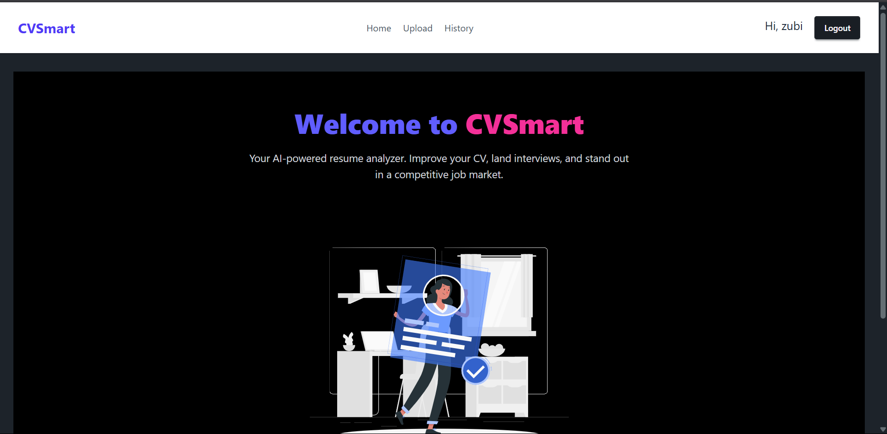

# 💼 CVSmart – AI-Powered Resume Analyzer
#### Video Demo:  <URL HERE>
#### Description:
**CVSmart** is an intelligent, full-stack Django web application that helps job seekers instantly analyze and improve their resumes based on job descriptions using a blend of AI-powered (Gemini) and rule-based analysis. It provides insights into ATS match scores, missing keywords, skill overlaps, and tailored improvement suggestions—all wrapped in a clean, responsive UI.



---

## 🚀 Features

### 🤖 AI-Powered Analysis (Gemini API)
- Analyzes resume and job description using Gemini 2.5 Flash.
- Returns markdown-formatted insights:
  - **ATS Match Score**
  - **Skill Match Summary**
  - **Strengths & Weaknesses**
  - **Suggestions for Improvement**
- Displayed beautifully using Markdown rendering on the frontend.

### 🧠 Rule-Based Analysis
- Tokenizes and compares keywords between the resume and job description.
- Calculates:
  - Matching keywords
  - Missing keywords
  - Skill match percentage
  - Resume word count (excluding short/informational words)

### 📄 Resume Upload System
- Only accepts `.pdf` files with size limit enforcement.
- Automatically extracts and cleans text from PDF.
- Filters out words ≤ 3 characters for better analysis.

### 📊 Result Dashboard
- Instant feedback displayed after analysis.
- Neatly separated AI and Non-AI sections.
- Job Description and Resume Text with **Read More/Less** toggles.

### 🗂️ History View (Logged-In Users)
- Displays a personal list of all uploaded resumes and analysis reports.
- Easy access to revisit past insights.

---

## 🛠️ Tech Stack

| Layer          | Tools Used                                     |
|----------------|------------------------------------------------|
| **Backend**    | Django, Python, Gemini 2.5 Flash API (via `google.generativeai`) |
| **Frontend**   | HTML5, TailwindCSS, Markdown rendering (`django-markdownify`) |
| **PDF Parsing**| `pdfplumber`                                   |
| **Storage**    | Filesystem (for resume storage), SQLite/PostgreSQL |
| **Authentication** | Django's built-in authentication system     |

---

## 📁 Project Structure

```bash
cvsmart/
│
├── analyzer/                # Resume analysis app (views, utils, models)
├── users/                   # User auth, login, and history view
├── cvsmart/                 # Project settings and URLs
├── templates/               # HTML templates
│   ├── analyzer/            # Resume upload, result, and history views
│   ├── users/               # Login/register templates
│   └── components/          # Reusable UI blocks
├── static/                  # Custom static files (used in dev)
│   ├── img/                 # Logos, illustrations
│   └── src/                 # JS, input Tailwind files, etc.
├── staticfiles/            # Collected static files (used in prod)
├── resumes/                 # Folder for uploaded PDF resumes
├── theme/                   # Tailwind theme build setup
├── manage.py
├── requirements.txt
└── README.md
